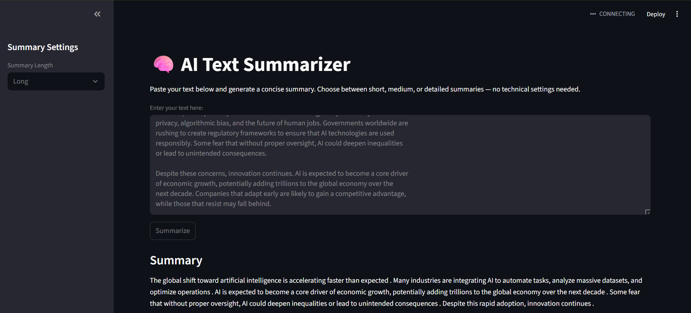
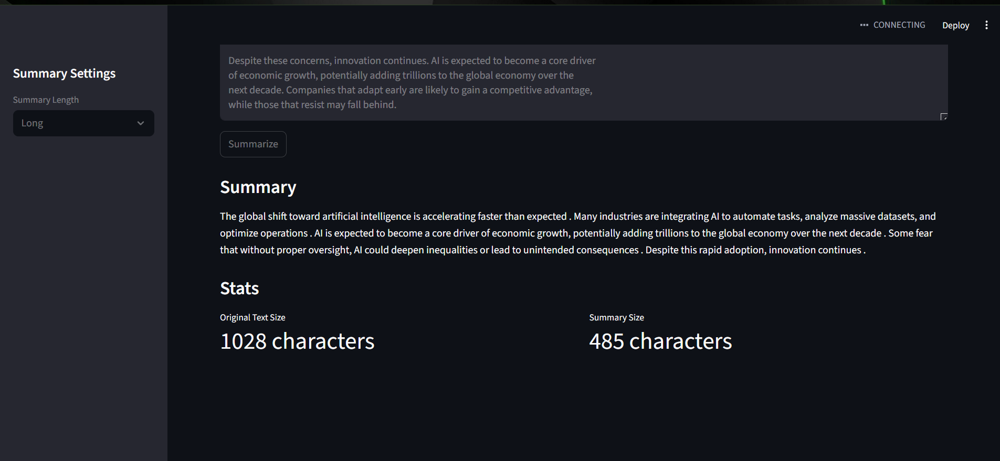

# AI Text Summarizer

A simple text summarization web application using FastAPI (backend), Hugging Face BART model,
Streamlit for the frontend, and Docker for deployment.

## 🧠 Streamlit UI Preview

Below is the simple, user-friendly interface built with Streamlit:

📌 Features
🧠 AI Summarization

Uses Hugging Face BART-based transformer model.

Supports Short, Medium, and Long summary modes.

Automatically adjusts summary detail level.

⚡ FastAPI Backend

REST endpoint: POST /summarize

Validates input using Pydantic

Returns summary + length stats

🎨 Streamlit Frontend

Simple UI for non-technical users

Clean summary interface

Customizable summary length (Short/Medium/Long)

📦 Docker Support

Containerized backend using Python 3.11-slim

HF cache mapped inside container

Production-ready Uvicorn server

🚀 How to Run the Project
1️⃣ Clone the Repository
git clone https://github.com/<sourav-c0des>/ai-text-summarizer.git
cd ai-text-summarizer

🐍 2️⃣ Create Virtual Environment
python -m venv venv
venv\Scripts\activate      # Windows

📦 3️⃣ Install Dependencies
pip install -r requirements.txt

🧪 4️⃣ Test the Summarizer (Optional)
python test_summarizer.py

You should see:

model loading logs

summary output

⚡ 5️⃣ Run FastAPI Backend
uvicorn app.main:app --reload

Now open:

Swagger UI: http://127.0.0.1:8000/docs

Root health check: http://127.0.0.1:8000/

🎨 6️⃣ Run Streamlit Frontend

Open another terminal:

streamlit run frontend/app.py

UI opens at:

http://localhost:8501

Paste text → choose summary length → get instant AI summary.

🐳 Docker Support
Build the image:
docker build -t ai-text-summarizer-api .

Run the container:
docker run -p 8000:8000 ai-text-summarizer-api

FastAPI will run at:

http://localhost:8000
http://localhost:8000/docs